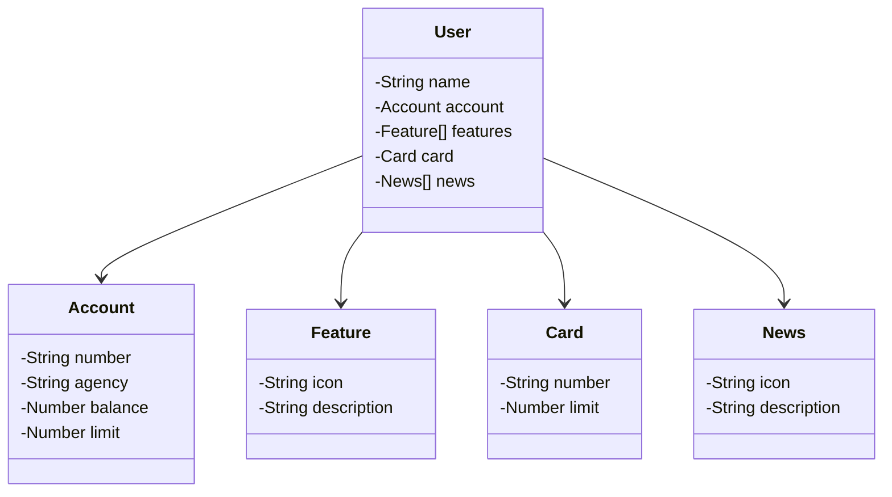

# railwayTest

##### 📎 Modelo Spring 
 ```https://start.spring.io/#!type=gradle-project&language=java&platformVersion=3.3.0&packaging=jar&jvmVersion=17&groupId=estudos&artifactId=railwayTest&name=railwayTest&description=Demo%20project%20for%20Spring%20Boot&packageName=estudos.railwayTest&dependencies=web,data-jpa,h2,postgresql```

##### 💻 Tech

- Java 17
- Spring Boot
- Railway

##### ⭕ Tecnologias úteis


 - [Mermaid] - Diagramas de classe.
 - [JSON Editor Online] - Editor de JSON.


## 📑 Diagrama de Classes




[Mermaid]:  <https://mermaid.js.org/syntax/classDiagram.html>
[JSON Editor Online]: <https://jsoneditoronline.org/>
